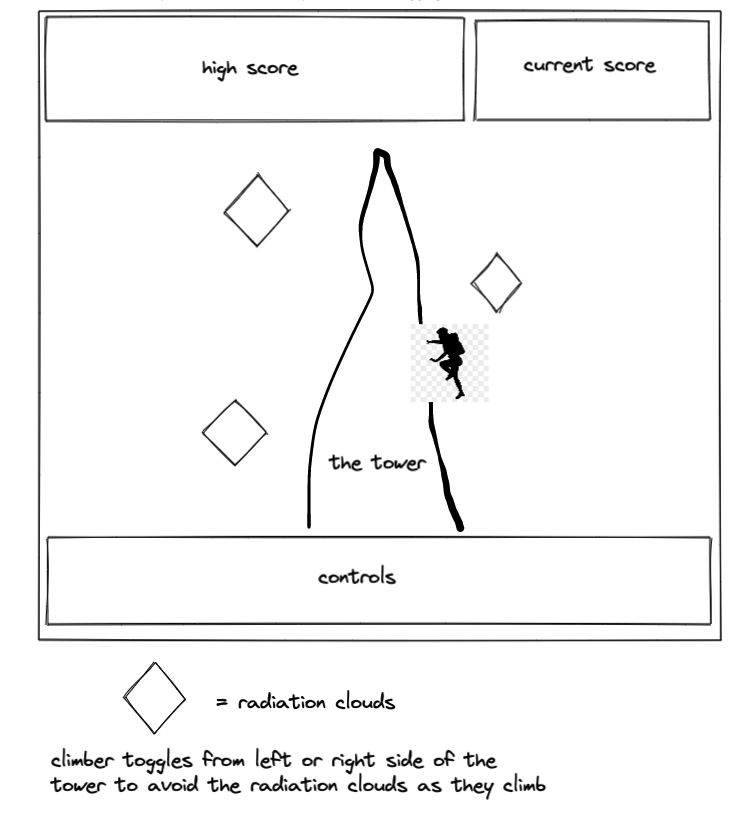

# G5-tower-ascender
G5 tower ascender is a game where the user tries to climb to the top of a G5 tower to fix the antennae. On the climb, the user will encounter radiation clouds that will prove fatal if hit. Uses WASD directional controls to navigate the tower and avoid the clouds. score is calculated by number of raiation clouds avoided.

